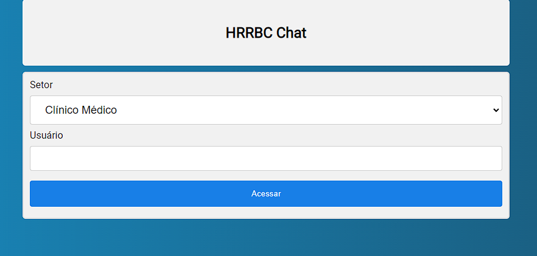
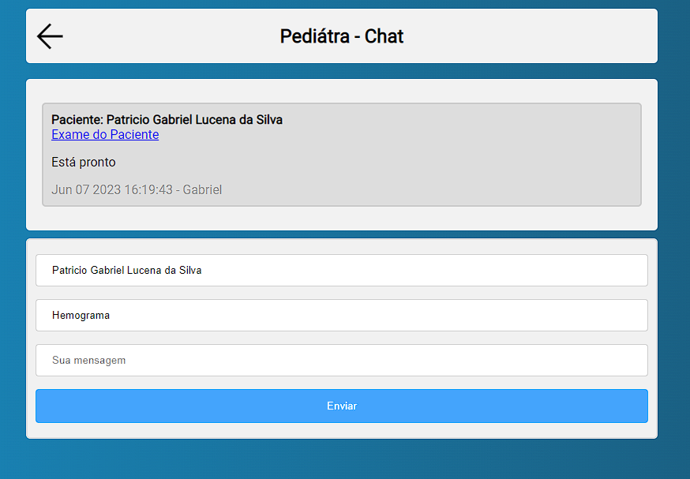

# Chat-Projeto

Bem-vindo ao Chat-Projeto! Este é um aplicativo de chat desenvolvido utilizando Django, Python, SQLite, JavaScript, HTML e CSS. Ele permite que os usuários se conectem e troquem mensagens em tempo real. Este documento descreve os principais aspectos do projeto e fornece instruções sobre como configurá-lo e executá-lo em seu ambiente local.

## Funcionalidades

- Registro e autenticação de usuários
- Criação de salas de chat
- Envio e recebimento de mensagens em tempo real
- Listagem de usuários online
- Notificações de novas mensagens

## Requisitos

Certifique-se de ter as seguintes ferramentas instaladas em seu sistema:

- Python (versão 3.7 ou superior)
- Django (versão 3.0 ou superior)
- SQLite (ou outro banco de dados suportado pelo Django)
- Git (opcional, para clonar o repositório)

## Configuração

1. Clone este repositório para o seu ambiente local (ou faça o download do ZIP):

```
git clone https://github.com/seu-usuario/chat-projeto.git
```

2. Navegue até o diretório raiz do projeto:

```
cd chat-projeto
```

3. Crie e ative um ambiente virtual (recomendado):

```
python3 -m venv venv
source venv/bin/activate
```

4. Instale as dependências do projeto:

```
pip install -r requirements.txt
```

5. Execute as migrações do banco de dados:

```
python manage.py migrate 
```

6. Inicie o servidor de desenvolvimento:

```
python manage.py migrate --run-syncdb
```

7. Abra o navegador e acesse `http://localhost:8000` para visualizar o aplicativo.

## Contribuição

Se você deseja contribuir para o projeto, siga as etapas abaixo:

1. Fork este repositório e clone-o em seu ambiente local.

2. Crie um branch para sua nova funcionalidade:

```
git checkout -b minha-nova-funcionalidade
```

3. Faça as alterações necessárias e faça commit das mesmas:

```
git commit -m "Adiciona minha nova funcionalidade"
```

4. Envie as alterações para o repositório remoto:

```
git push origin minha-nova-funcionalidade
```

5. Abra uma pull request no repositório original.

## Capturas de tela




## Licença

Este projeto está licenciado sob a [MIT License](LICENSE).

---
Espero que este README tenha fornecido uma visão geral completa do Chat-Projeto. Divirta-se explorando o aplicativo e não hesite em entrar em contato caso precise de ajuda ou queira contribuir!